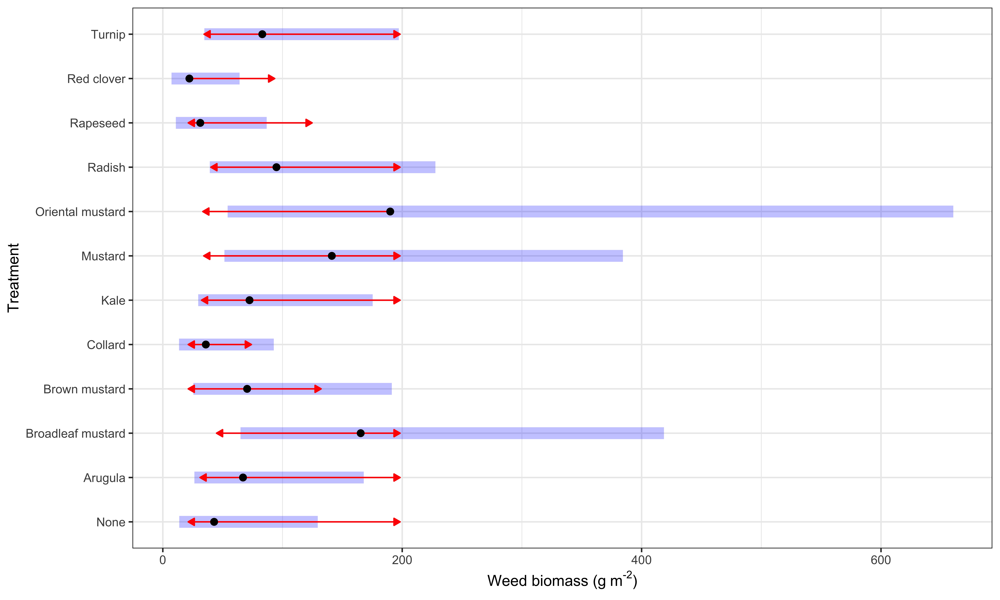

Arithmetic means of crop and weed biomass (g/m$^{-2}$) are in Figure \@ref(fig:summ).  
<div class="figure">

<p class="caption">(\#fig:summ)Arithmetic means of crop and weed biomass.</p>
</div>


### Results  

Crop biomass was the strongest factor affecting weed biomass (Table \@ref(tab:ancova-crops) so a non-linear regression was fitted for crop - weed competition (Figure \@ref(fig:nls-plot)). Collard's weed suppression was distinctive among all the treatments (Table \@ref(tab:anova-crops).   


A nonlinear regression was fitted with $Y = \frac{C}{1 + I_w B_c}$, where  

$Y$ is predicted weed biomass,  
$C$ is weed biomass in the control treatment,   
$I_w$ is an estimated coefficient,    
$B_c$ is crop biomass in cover crop treatment  


```
## 
## Formula: weed.biomass.g.per.sq.m ~ 148/(1 + i.w * crop.biomass.g.per.sq.m)
## 
## Parameters:
##     Estimate Std. Error t value Pr(>|t|)  
## i.w 0.008078   0.003155   2.561   0.0137 *
## ---
## Signif. codes:  0 '***' 0.001 '**' 0.01 '*' 0.05 '.' 0.1 ' ' 1
## 
## Residual standard error: 75.39 on 47 degrees of freedom
## 
## Number of iterations to convergence: 6 
## Achieved convergence tolerance: 3.688e-06
```

<div class="figure">

<p class="caption">(\#fig:nls-plot)Weed suppression from Brassicaceae biomass</p>
</div>


<div class="figure">

<p class="caption">(\#fig:nls-plot-labeled)Weed suppression from Brassicaceae biomass</p>
</div>


### Linear model diagnosis 

Weed suppression from different *Brassicacaea* species was comparable among each other and with the control treatments (Table \@ref(tab:ancova-weeds)), even though crop biomass differed by species (Table \@ref(tab:ancova-crops)). 

Using `ggResidpanel` version 0.3.0 (Goode and Rey, 2019) for model diagnosis, no predictable pattern in the plots of residuals vs. predicted values suggests that the analysis models fit the data well (Figures \@ref(fig:diag-crops) and \@ref(fig:diag-weeds)), but AIC values of the ANCOVA models were lower than those of the ANOVA models: 448 vs. 459 for crop responses in ANCOVA vs. ANOVA; and 159 vs. 174 for weed biomass responses in ANCOVA vs ANOVA.   


### Crop biomass in response to treatment and weed biomass 


```r
fsb.crops <- fsb.wide  %>% filter(treatment != "N") # Control treatments had no crop
crops.lm1 <- lm(crop.biomass.g.per.sq.m  ~ as.factor(block) + species.y + weed.biomass.g.per.sq.m, data = fsb.crops)


crops.lm2 <- lm(crop.biomass.g.per.sq.m  ~ as.factor(block) + species.y , data = fsb.crops)
resid_panel(crops.lm2)
```

<div class="figure">

<p class="caption">(\#fig:diag-crops-1)Diagnosis plot for the ANCOVA and ANOVA models of crop biomass responses</p>
</div>

```r
list(crops.lm1, crops.lm2) %>% 
  lapply(resid_panel, nrow = 2) %>% 
  wrap_plots() +
  plot_annotation(tag_levels = "A")
```

<div class="figure">

<p class="caption">(\#fig:diag-crops-2)Diagnosis plot for the ANCOVA and ANOVA models of crop biomass responses</p>
</div>

```r
# AIC(crops.lm1, crops.lm2) 448 vs 459
```


### Weed biomass in response to treatment and crop biomass - ANCOVA

```r
weeds.lm1 <- lm(log(weed.biomass.g.per.sq.m + 1) ~ as.factor(block) + species.y + crop.biomass.g.per.sq.m, data = fsb.wide )


weeds.lm2 <- lm(log(weed.biomass.g.per.sq.m + 1) ~ as.factor(block) + species.y , data = fsb.wide )

list(weeds.lm1, weeds.lm2) %>% 
  lapply(resid_panel, nrow = 2) %>% 
  wrap_plots() +
  plot_annotation(tag_levels = "A")
```

<div class="figure">

<p class="caption">(\#fig:diag-weeds)Diagnosis plot for the linear model of weed biomass responding to treatment and crop biomass</p>
</div>

```r
# AIC(weeds.lm1, weeds.lm2) 159 vs 174
```

### Linear models results  


```{=html}
<template id="464a8506-3095-4dfb-80c3-636654875c8e"><style>
.tabwid table{
  border-spacing:0px !important;
  border-collapse:collapse;
  line-height:1;
  margin-left:auto;
  margin-right:auto;
  border-width: 0;
  display: table;
  border-color: transparent;
  caption-side: top;
}
.tabwid-caption-bottom table{
  caption-side: bottom;
}
.tabwid_left table{
  margin-left:0;
}
.tabwid_right table{
  margin-right:0;
}
.tabwid td {
    padding: 0;
}
.tabwid a {
  text-decoration: none;
}
.tabwid thead {
    background-color: transparent;
}
.tabwid tfoot {
    background-color: transparent;
}
.tabwid table tr {
background-color: transparent;
}
.katex-display {
    margin: 0 0 !important;
}
</style><div class="tabwid"><style>.cl-dc13de98{}.cl-dc0e60c6{font-family:'Helvetica';font-size:11pt;font-weight:normal;font-style:normal;text-decoration:none;color:rgba(0, 0, 0, 1.00);background-color:transparent;}.cl-dc10b20e{margin:0;text-align:left;border-bottom: 0 solid rgba(0, 0, 0, 1.00);border-top: 0 solid rgba(0, 0, 0, 1.00);border-left: 0 solid rgba(0, 0, 0, 1.00);border-right: 0 solid rgba(0, 0, 0, 1.00);padding-bottom:5pt;padding-top:5pt;padding-left:5pt;padding-right:5pt;line-height: 1;background-color:transparent;}.cl-dc10c24e{width:0.75in;background-color:transparent;vertical-align: middle;border-bottom: 2pt solid rgba(102, 102, 102, 1.00);border-top: 2pt solid rgba(102, 102, 102, 1.00);border-left: 0 solid rgba(0, 0, 0, 1.00);border-right: 0 solid rgba(0, 0, 0, 1.00);margin-bottom:0;margin-top:0;margin-left:0;margin-right:0;}.cl-dc10c24f{width:0.75in;background-color:transparent;vertical-align: middle;border-bottom: 0 solid rgba(0, 0, 0, 1.00);border-top: 0 solid rgba(0, 0, 0, 1.00);border-left: 0 solid rgba(0, 0, 0, 1.00);border-right: 0 solid rgba(0, 0, 0, 1.00);margin-bottom:0;margin-top:0;margin-left:0;margin-right:0;}.cl-dc10c258{width:0.75in;background-color:transparent;vertical-align: middle;border-bottom: 2pt solid rgba(102, 102, 102, 1.00);border-top: 0 solid rgba(0, 0, 0, 1.00);border-left: 0 solid rgba(0, 0, 0, 1.00);border-right: 0 solid rgba(0, 0, 0, 1.00);margin-bottom:0;margin-top:0;margin-left:0;margin-right:0;}.cl-dc0980ec{font-family:'Helvetica';font-size:11pt;font-weight:normal;font-style:normal;text-decoration:none;color:rgba(0, 0, 0, 1.00);background-color:transparent;}</style><table class='cl-dc13de98'>

```

<caption>(\#tab:ancova-weeds)<span class="cl-dc0980ec">ANCOVA for weed biomass response. Weed biomass was transformed with ln(x + 1) to maintain data normality.</span></caption>

```{=html}

<thead><tr style="overflow-wrap:break-word;"><td class="cl-dc10c24e"><p class="cl-dc10b20e"><span class="cl-dc0e60c6">model term             </span></p></td><td class="cl-dc10c24e"><p class="cl-dc10b20e"><span class="cl-dc0e60c6">df1</span></p></td><td class="cl-dc10c24e"><p class="cl-dc10b20e"><span class="cl-dc0e60c6">df2</span></p></td><td class="cl-dc10c24e"><p class="cl-dc10b20e"><span class="cl-dc0e60c6">F.ratio</span></p></td><td class="cl-dc10c24e"><p class="cl-dc10b20e"><span class="cl-dc0e60c6">p.value</span></p></td></tr></thead><tbody><tr style="overflow-wrap:break-word;"><td class="cl-dc10c24f"><p class="cl-dc10b20e"><span class="cl-dc0e60c6">block                  </span></p></td><td class="cl-dc10c24f"><p class="cl-dc10b20e"><span class="cl-dc0e60c6">  3</span></p></td><td class="cl-dc10c24f"><p class="cl-dc10b20e"><span class="cl-dc0e60c6"> 32</span></p></td><td class="cl-dc10c24f"><p class="cl-dc10b20e"><span class="cl-dc0e60c6">  7.342</span></p></td><td class="cl-dc10c24f"><p class="cl-dc10b20e"><span class="cl-dc0e60c6"> 0.0007</span></p></td></tr><tr style="overflow-wrap:break-word;"><td class="cl-dc10c24f"><p class="cl-dc10b20e"><span class="cl-dc0e60c6">species.y              </span></p></td><td class="cl-dc10c24f"><p class="cl-dc10b20e"><span class="cl-dc0e60c6"> 11</span></p></td><td class="cl-dc10c24f"><p class="cl-dc10b20e"><span class="cl-dc0e60c6"> 32</span></p></td><td class="cl-dc10c24f"><p class="cl-dc10b20e"><span class="cl-dc0e60c6">  1.541</span></p></td><td class="cl-dc10c24f"><p class="cl-dc10b20e"><span class="cl-dc0e60c6"> 0.1652</span></p></td></tr><tr style="overflow-wrap:break-word;"><td class="cl-dc10c258"><p class="cl-dc10b20e"><span class="cl-dc0e60c6">crop.biomass.g.per.sq.m</span></p></td><td class="cl-dc10c258"><p class="cl-dc10b20e"><span class="cl-dc0e60c6">  1</span></p></td><td class="cl-dc10c258"><p class="cl-dc10b20e"><span class="cl-dc0e60c6"> 32</span></p></td><td class="cl-dc10c258"><p class="cl-dc10b20e"><span class="cl-dc0e60c6"> 13.111</span></p></td><td class="cl-dc10c258"><p class="cl-dc10b20e"><span class="cl-dc0e60c6"> 0.0010</span></p></td></tr></tbody></table></div></template>
<div class="flextable-shadow-host" id="e2627637-7c13-49e3-801b-1cd6f0e08bd2"></div>
<script>
var dest = document.getElementById("e2627637-7c13-49e3-801b-1cd6f0e08bd2");
var template = document.getElementById("464a8506-3095-4dfb-80c3-636654875c8e");
var caption = template.content.querySelector("caption");
var fantome = dest.attachShadow({mode: 'open'});
var templateContent = template.content;
fantome.appendChild(templateContent);
</script>

```

```{=html}
<template id="d17e7ebf-cc4a-4f7d-8126-e9fccfef602e"><style>
.tabwid table{
  border-spacing:0px !important;
  border-collapse:collapse;
  line-height:1;
  margin-left:auto;
  margin-right:auto;
  border-width: 0;
  display: table;
  border-color: transparent;
  caption-side: top;
}
.tabwid-caption-bottom table{
  caption-side: bottom;
}
.tabwid_left table{
  margin-left:0;
}
.tabwid_right table{
  margin-right:0;
}
.tabwid td {
    padding: 0;
}
.tabwid a {
  text-decoration: none;
}
.tabwid thead {
    background-color: transparent;
}
.tabwid tfoot {
    background-color: transparent;
}
.tabwid table tr {
background-color: transparent;
}
.katex-display {
    margin: 0 0 !important;
}
</style><div class="tabwid"><style>.cl-dc27c534{}.cl-dc22e76c{font-family:'Helvetica';font-size:11pt;font-weight:normal;font-style:normal;text-decoration:none;color:rgba(0, 0, 0, 1.00);background-color:transparent;}.cl-dc250858{margin:0;text-align:left;border-bottom: 0 solid rgba(0, 0, 0, 1.00);border-top: 0 solid rgba(0, 0, 0, 1.00);border-left: 0 solid rgba(0, 0, 0, 1.00);border-right: 0 solid rgba(0, 0, 0, 1.00);padding-bottom:5pt;padding-top:5pt;padding-left:5pt;padding-right:5pt;line-height: 1;background-color:transparent;}.cl-dc2515aa{width:0.75in;background-color:transparent;vertical-align: middle;border-bottom: 2pt solid rgba(102, 102, 102, 1.00);border-top: 2pt solid rgba(102, 102, 102, 1.00);border-left: 0 solid rgba(0, 0, 0, 1.00);border-right: 0 solid rgba(0, 0, 0, 1.00);margin-bottom:0;margin-top:0;margin-left:0;margin-right:0;}.cl-dc2515b4{width:0.75in;background-color:transparent;vertical-align: middle;border-bottom: 0 solid rgba(0, 0, 0, 1.00);border-top: 0 solid rgba(0, 0, 0, 1.00);border-left: 0 solid rgba(0, 0, 0, 1.00);border-right: 0 solid rgba(0, 0, 0, 1.00);margin-bottom:0;margin-top:0;margin-left:0;margin-right:0;}.cl-dc2515be{width:0.75in;background-color:transparent;vertical-align: middle;border-bottom: 2pt solid rgba(102, 102, 102, 1.00);border-top: 0 solid rgba(0, 0, 0, 1.00);border-left: 0 solid rgba(0, 0, 0, 1.00);border-right: 0 solid rgba(0, 0, 0, 1.00);margin-bottom:0;margin-top:0;margin-left:0;margin-right:0;}.cl-dc19e8c4{font-family:'Helvetica';font-size:11pt;font-weight:normal;font-style:normal;text-decoration:none;color:rgba(0, 0, 0, 1.00);background-color:transparent;}</style><table class='cl-dc27c534'>

```

<caption>(\#tab:ancova-crops)<span class="cl-dc19e8c4">ANCOVA for crop biomass response. Crop biomass was analyzed on the original scale.</span></caption>

```{=html}

<thead><tr style="overflow-wrap:break-word;"><td class="cl-dc2515aa"><p class="cl-dc250858"><span class="cl-dc22e76c">model term             </span></p></td><td class="cl-dc2515aa"><p class="cl-dc250858"><span class="cl-dc22e76c">df1</span></p></td><td class="cl-dc2515aa"><p class="cl-dc250858"><span class="cl-dc22e76c">df2</span></p></td><td class="cl-dc2515aa"><p class="cl-dc250858"><span class="cl-dc22e76c">F.ratio</span></p></td><td class="cl-dc2515aa"><p class="cl-dc250858"><span class="cl-dc22e76c">p.value</span></p></td></tr></thead><tbody><tr style="overflow-wrap:break-word;"><td class="cl-dc2515b4"><p class="cl-dc250858"><span class="cl-dc22e76c">block                  </span></p></td><td class="cl-dc2515b4"><p class="cl-dc250858"><span class="cl-dc22e76c">  3</span></p></td><td class="cl-dc2515b4"><p class="cl-dc250858"><span class="cl-dc22e76c"> 29</span></p></td><td class="cl-dc2515b4"><p class="cl-dc250858"><span class="cl-dc22e76c">  7.072</span></p></td><td class="cl-dc2515b4"><p class="cl-dc250858"><span class="cl-dc22e76c"> 0.0010</span></p></td></tr><tr style="overflow-wrap:break-word;"><td class="cl-dc2515b4"><p class="cl-dc250858"><span class="cl-dc22e76c">species.y              </span></p></td><td class="cl-dc2515b4"><p class="cl-dc250858"><span class="cl-dc22e76c"> 10</span></p></td><td class="cl-dc2515b4"><p class="cl-dc250858"><span class="cl-dc22e76c"> 29</span></p></td><td class="cl-dc2515b4"><p class="cl-dc250858"><span class="cl-dc22e76c"> 10.365</span></p></td><td class="cl-dc2515b4"><p class="cl-dc250858"><span class="cl-dc22e76c"> &lt;.0001</span></p></td></tr><tr style="overflow-wrap:break-word;"><td class="cl-dc2515be"><p class="cl-dc250858"><span class="cl-dc22e76c">weed.biomass.g.per.sq.m</span></p></td><td class="cl-dc2515be"><p class="cl-dc250858"><span class="cl-dc22e76c">  1</span></p></td><td class="cl-dc2515be"><p class="cl-dc250858"><span class="cl-dc22e76c"> 29</span></p></td><td class="cl-dc2515be"><p class="cl-dc250858"><span class="cl-dc22e76c">  8.706</span></p></td><td class="cl-dc2515be"><p class="cl-dc250858"><span class="cl-dc22e76c"> 0.0062</span></p></td></tr></tbody></table></div></template>
<div class="flextable-shadow-host" id="4a11ad03-89c6-4724-a109-99475ffba81e"></div>
<script>
var dest = document.getElementById("4a11ad03-89c6-4724-a109-99475ffba81e");
var template = document.getElementById("d17e7ebf-cc4a-4f7d-8126-e9fccfef602e");
var caption = template.content.querySelector("caption");
var fantome = dest.attachShadow({mode: 'open'});
var templateContent = template.content;
fantome.appendChild(templateContent);
</script>

```


```{=html}
<template id="92156a2d-327f-49ca-9da3-362578d00b5e"><style>
.tabwid table{
  border-spacing:0px !important;
  border-collapse:collapse;
  line-height:1;
  margin-left:auto;
  margin-right:auto;
  border-width: 0;
  display: table;
  border-color: transparent;
  caption-side: top;
}
.tabwid-caption-bottom table{
  caption-side: bottom;
}
.tabwid_left table{
  margin-left:0;
}
.tabwid_right table{
  margin-right:0;
}
.tabwid td {
    padding: 0;
}
.tabwid a {
  text-decoration: none;
}
.tabwid thead {
    background-color: transparent;
}
.tabwid tfoot {
    background-color: transparent;
}
.tabwid table tr {
background-color: transparent;
}
.katex-display {
    margin: 0 0 !important;
}
</style><div class="tabwid"><style>.cl-dc484c50{}.cl-dc434a52{font-family:'Helvetica';font-size:11pt;font-weight:normal;font-style:normal;text-decoration:none;color:rgba(0, 0, 0, 1.00);background-color:transparent;}.cl-dc458858{margin:0;text-align:left;border-bottom: 0 solid rgba(0, 0, 0, 1.00);border-top: 0 solid rgba(0, 0, 0, 1.00);border-left: 0 solid rgba(0, 0, 0, 1.00);border-right: 0 solid rgba(0, 0, 0, 1.00);padding-bottom:5pt;padding-top:5pt;padding-left:5pt;padding-right:5pt;line-height: 1;background-color:transparent;}.cl-dc459410{width:0.75in;background-color:transparent;vertical-align: middle;border-bottom: 2pt solid rgba(102, 102, 102, 1.00);border-top: 2pt solid rgba(102, 102, 102, 1.00);border-left: 0 solid rgba(0, 0, 0, 1.00);border-right: 0 solid rgba(0, 0, 0, 1.00);margin-bottom:0;margin-top:0;margin-left:0;margin-right:0;}.cl-dc459411{width:0.75in;background-color:transparent;vertical-align: middle;border-bottom: 0 solid rgba(0, 0, 0, 1.00);border-top: 0 solid rgba(0, 0, 0, 1.00);border-left: 0 solid rgba(0, 0, 0, 1.00);border-right: 0 solid rgba(0, 0, 0, 1.00);margin-bottom:0;margin-top:0;margin-left:0;margin-right:0;}.cl-dc45941a{width:0.75in;background-color:transparent;vertical-align: middle;border-bottom: 2pt solid rgba(102, 102, 102, 1.00);border-top: 0 solid rgba(0, 0, 0, 1.00);border-left: 0 solid rgba(0, 0, 0, 1.00);border-right: 0 solid rgba(0, 0, 0, 1.00);margin-bottom:0;margin-top:0;margin-left:0;margin-right:0;}.cl-dc406594{font-family:'Helvetica';font-size:11pt;font-weight:normal;font-style:normal;text-decoration:none;color:rgba(0, 0, 0, 1.00);background-color:transparent;}</style><table class='cl-dc484c50'>

```

<caption>(\#tab:anova-weeds)<span class="cl-dc406594">ANOVA for weed biomass response. Weed biomass was transformed with ln(x + 1) to maintain data normality.</span></caption>

```{=html}

<thead><tr style="overflow-wrap:break-word;"><td class="cl-dc459410"><p class="cl-dc458858"><span class="cl-dc434a52">model term</span></p></td><td class="cl-dc459410"><p class="cl-dc458858"><span class="cl-dc434a52">df1</span></p></td><td class="cl-dc459410"><p class="cl-dc458858"><span class="cl-dc434a52">df2</span></p></td><td class="cl-dc459410"><p class="cl-dc458858"><span class="cl-dc434a52">F.ratio</span></p></td><td class="cl-dc459410"><p class="cl-dc458858"><span class="cl-dc434a52">p.value</span></p></td></tr></thead><tbody><tr style="overflow-wrap:break-word;"><td class="cl-dc459411"><p class="cl-dc458858"><span class="cl-dc434a52">block     </span></p></td><td class="cl-dc459411"><p class="cl-dc458858"><span class="cl-dc434a52">  3</span></p></td><td class="cl-dc459411"><p class="cl-dc458858"><span class="cl-dc434a52"> 33</span></p></td><td class="cl-dc459411"><p class="cl-dc458858"><span class="cl-dc434a52">  3.264</span></p></td><td class="cl-dc459411"><p class="cl-dc458858"><span class="cl-dc434a52"> 0.0335</span></p></td></tr><tr style="overflow-wrap:break-word;"><td class="cl-dc45941a"><p class="cl-dc458858"><span class="cl-dc434a52">species.y </span></p></td><td class="cl-dc45941a"><p class="cl-dc458858"><span class="cl-dc434a52"> 11</span></p></td><td class="cl-dc45941a"><p class="cl-dc458858"><span class="cl-dc434a52"> 33</span></p></td><td class="cl-dc45941a"><p class="cl-dc458858"><span class="cl-dc434a52">  1.869</span></p></td><td class="cl-dc45941a"><p class="cl-dc458858"><span class="cl-dc434a52"> 0.0814</span></p></td></tr></tbody></table></div></template>
<div class="flextable-shadow-host" id="31ee1c93-1b6f-4860-ab4e-b66e7b0fad45"></div>
<script>
var dest = document.getElementById("31ee1c93-1b6f-4860-ab4e-b66e7b0fad45");
var template = document.getElementById("92156a2d-327f-49ca-9da3-362578d00b5e");
var caption = template.content.querySelector("caption");
var fantome = dest.attachShadow({mode: 'open'});
var templateContent = template.content;
fantome.appendChild(templateContent);
</script>

```


<!-- -->

```{=html}
<template id="d5dbc7e3-f073-4249-8b56-0e081c7bda01"><style>
.tabwid table{
  border-spacing:0px !important;
  border-collapse:collapse;
  line-height:1;
  margin-left:auto;
  margin-right:auto;
  border-width: 0;
  display: table;
  border-color: transparent;
  caption-side: top;
}
.tabwid-caption-bottom table{
  caption-side: bottom;
}
.tabwid_left table{
  margin-left:0;
}
.tabwid_right table{
  margin-right:0;
}
.tabwid td {
    padding: 0;
}
.tabwid a {
  text-decoration: none;
}
.tabwid thead {
    background-color: transparent;
}
.tabwid tfoot {
    background-color: transparent;
}
.tabwid table tr {
background-color: transparent;
}
.katex-display {
    margin: 0 0 !important;
}
</style><div class="tabwid"><style>.cl-dce6652a{}.cl-dce03376{font-family:'Helvetica';font-size:11pt;font-weight:normal;font-style:normal;text-decoration:none;color:rgba(0, 0, 0, 1.00);background-color:transparent;}.cl-dce28072{margin:0;text-align:left;border-bottom: 0 solid rgba(0, 0, 0, 1.00);border-top: 0 solid rgba(0, 0, 0, 1.00);border-left: 0 solid rgba(0, 0, 0, 1.00);border-right: 0 solid rgba(0, 0, 0, 1.00);padding-bottom:5pt;padding-top:5pt;padding-left:5pt;padding-right:5pt;line-height: 1;background-color:transparent;}.cl-dce28fd6{width:0.75in;background-color:transparent;vertical-align: middle;border-bottom: 2pt solid rgba(102, 102, 102, 1.00);border-top: 2pt solid rgba(102, 102, 102, 1.00);border-left: 0 solid rgba(0, 0, 0, 1.00);border-right: 0 solid rgba(0, 0, 0, 1.00);margin-bottom:0;margin-top:0;margin-left:0;margin-right:0;}.cl-dce28fd7{width:0.75in;background-color:transparent;vertical-align: middle;border-bottom: 0 solid rgba(0, 0, 0, 1.00);border-top: 0 solid rgba(0, 0, 0, 1.00);border-left: 0 solid rgba(0, 0, 0, 1.00);border-right: 0 solid rgba(0, 0, 0, 1.00);margin-bottom:0;margin-top:0;margin-left:0;margin-right:0;}.cl-dce28fe0{width:0.75in;background-color:transparent;vertical-align: middle;border-bottom: 2pt solid rgba(102, 102, 102, 1.00);border-top: 0 solid rgba(0, 0, 0, 1.00);border-left: 0 solid rgba(0, 0, 0, 1.00);border-right: 0 solid rgba(0, 0, 0, 1.00);margin-bottom:0;margin-top:0;margin-left:0;margin-right:0;}.cl-dcdd71d6{font-family:'Helvetica';font-size:11pt;font-weight:normal;font-style:normal;text-decoration:none;color:rgba(0, 0, 0, 1.00);background-color:transparent;}</style><table class='cl-dce6652a'>

```

<caption>(\#tab:anova-crops)<span class="cl-dcdd71d6">ANOVA for crop biomass response. Crop biomass was analyzed on the original scale.</span></caption>

```{=html}

<thead><tr style="overflow-wrap:break-word;"><td class="cl-dce28fd6"><p class="cl-dce28072"><span class="cl-dce03376">model term</span></p></td><td class="cl-dce28fd6"><p class="cl-dce28072"><span class="cl-dce03376">df1</span></p></td><td class="cl-dce28fd6"><p class="cl-dce28072"><span class="cl-dce03376">df2</span></p></td><td class="cl-dce28fd6"><p class="cl-dce28072"><span class="cl-dce03376">F.ratio</span></p></td><td class="cl-dce28fd6"><p class="cl-dce28072"><span class="cl-dce03376">p.value</span></p></td></tr></thead><tbody><tr style="overflow-wrap:break-word;"><td class="cl-dce28fd7"><p class="cl-dce28072"><span class="cl-dce03376">block     </span></p></td><td class="cl-dce28fd7"><p class="cl-dce28072"><span class="cl-dce03376">  3</span></p></td><td class="cl-dce28fd7"><p class="cl-dce28072"><span class="cl-dce03376"> 30</span></p></td><td class="cl-dce28fd7"><p class="cl-dce28072"><span class="cl-dce03376">  3.846</span></p></td><td class="cl-dce28fd7"><p class="cl-dce28072"><span class="cl-dce03376"> 0.0193</span></p></td></tr><tr style="overflow-wrap:break-word;"><td class="cl-dce28fe0"><p class="cl-dce28072"><span class="cl-dce03376">species.y </span></p></td><td class="cl-dce28fe0"><p class="cl-dce28072"><span class="cl-dce03376"> 10</span></p></td><td class="cl-dce28fe0"><p class="cl-dce28072"><span class="cl-dce03376"> 30</span></p></td><td class="cl-dce28fe0"><p class="cl-dce28072"><span class="cl-dce03376"> 10.793</span></p></td><td class="cl-dce28fe0"><p class="cl-dce28072"><span class="cl-dce03376"> &lt;.0001</span></p></td></tr></tbody></table></div></template>
<div class="flextable-shadow-host" id="2dffd992-342c-4ae3-9214-9f9e22482eb2"></div>
<script>
var dest = document.getElementById("2dffd992-342c-4ae3-9214-9f9e22482eb2");
var template = document.getElementById("d5dbc7e3-f073-4249-8b56-0e081c7bda01");
var caption = template.content.querySelector("caption");
var fantome = dest.attachShadow({mode: 'open'});
var templateContent = template.content;
fantome.appendChild(templateContent);
</script>

```


Estimated marginal means of weed and crop biomass in each treatment are shown in Figures \@ref(fig:weed-contrast) and \@ref(fig:crop-contrast).    


<div class="figure">

<p class="caption">(\#fig:weed-contrast)Estimated marginal means of weed biomass (back transformed from ln(x +1)). The error bars represent 1 sd on each side.</p>
</div>


<div class="figure">

<p class="caption">(\#fig:crop-contrast)Estimated marginal means of crop biomass. The error bars represent 1 sd on each side.</p>
</div>

The arrow plots below (Figures \@ref(fig:weed-emmip) and \@ref(fig:crop-emmip)) convey the same information with the bar charts, but are quicker to make. 

<div class="figure">

<p class="caption">(\#fig:weed-emmip)Estimated marginal means of weed biomass (back transformed from ln(x +1)). The black dots are the estimated marginal means. The blue bars indicate the estimated 95% confidence intervals. The arrows indicate whether two estimated means were significantly different. Overlapping arrows means non-significant difference.</p>
</div>

<div class="figure">

<p class="caption">(\#fig:crop-emmip)Estimated marginal means of crop biomass. The blue bars indicate the estimated 95% confidence intervals. The black dots are the estimated marginal means. The arrows indicate whether two estimated means were significantly different. Overlapping arrows means non-significant difference.</p>
</div>
