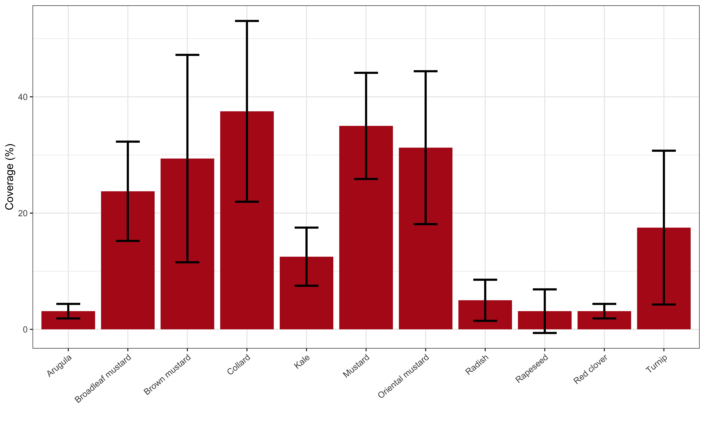

Arithmetic means of speculative coverage are in Figure \@ref(fig:summ-coverage).  
<div class="figure">

<p class="caption">(\#fig:summ-coverage)Arithmetic means of crop speculative coverage.</p>
</div>

```r
coverage.lm1 <- lm(speculative.pct.coverage   ~ as.factor(block) + species , data = coverage)
resid_panel(coverage.lm1)
```

<!-- -->

```r
joint_tests(coverage.lm1)
```

```
##  model term df1 df2 F.ratio p.value
##  block        3  33   8.267  0.0003
##  species     11  33  13.630  <.0001
```


```r
plot(emmeans(coverage.lm1 , "species"), comparisons = TRUE) + 
  xlab("Speculative coverage (%)" ) +
  ylab("Species") #+ scale_y_discrete(labels = crops_labels)
```

<!-- -->
