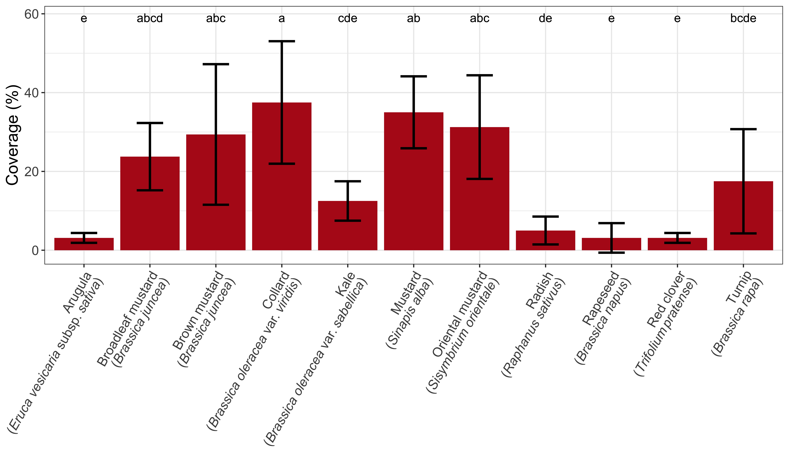

Arithmetic means of speculative coverage are in Figure \@ref(fig:summ-coverage).  
<div class="figure">

<p class="caption">(\#fig:summ-coverage)Arithmetic means of crop speculative coverage.</p>
</div>


```r
coverage.lm1 <- lm(speculative.pct.coverage   ~ as.factor(block) + species , data = coverage, subset = (treatment != "N"))
resid_panel(coverage.lm1)
```

<!-- -->

```r
joint_tests(coverage.lm1)
```

```
##  model term df1 df2 F.ratio p.value
##  block        3  30   8.800  0.0002
##  species     10  30  12.567  <.0001
```


```r
plot(emmeans(coverage.lm1 , "species"), comparisons = TRUE) + 
#    scale_y_discrete(limits = rev(levels(species))) +
  xlab("Speculative coverage (%)" ) +
  ylab("Cover crop")  + 
#  coord_flip() +
  theme(text = element_text(size=20)) +
  theme_classic()
```

<div class="figure">

<p class="caption">(\#fig:cover-emmip)Estimate speculative percent coverage of different cover crop species</p>
</div>

```r
coverage.emm <- emmeans(coverage.lm1 , "species") %>% as.data.frame()

anova <- aov(speculative.pct.coverage   ~ as.factor(block) + species , data = coverage, subset = (treatment != "N"))

# Tukey's test
tukey <- TukeyHSD(anova )

# compact letter display
cld <- multcompLetters4(anova, tukey)
# https://www.mathiasecology.com/code 
cld.df <- data.frame(multcompLetters(TukeyHSD(anova)$species[,4])$Letters) 

cld.df$species <- rownames(cld.df)

coverage.emm %>% left_join(cld.df, by = "species")
```

```
##  species           emmean   SE df lower.CL upper.CL
##  Arugula             3.12 3.86 30    -4.75     11.0
##  Broadleaf mustard  23.75 3.86 30    15.87     31.6
##  Brown mustard      29.38 3.86 30    21.50     37.3
##  Collard            37.50 3.86 30    29.62     45.4
##  Kale               12.50 3.86 30     4.62     20.4
##  Mustard            35.00 3.86 30    27.12     42.9
##  Oriental mustard   31.25 3.86 30    23.37     39.1
##  Radish              5.00 3.86 30    -2.88     12.9
##  Rapeseed            3.12 3.86 30    -4.75     11.0
##  Red clover          3.12 3.86 30    -4.75     11.0
##  Turnip             17.50 3.86 30     9.62     25.4
##  multcompLetters.TukeyHSD.anova..species...4...Letters
##  e                                                    
##  abcd                                                 
##  abc                                                  
##  a                                                    
##  cde                                                  
##  ab                                                   
##  abc                                                  
##  de                                                   
##  e                                                    
##  e                                                    
##  bcde                                                 
## 
## Results are averaged over the levels of: block 
## Confidence level used: 0.95
```


```r
coverage %>%
  filter(treatment != "N") %>%
  dplyr::group_by(treatment, species2) %>%
    mutate(sp.coverage = mean(speculative.pct.coverage),
    sd = sd(speculative.pct.coverage),
    n = n(),
    se = sd / sqrt(n)) %>%
  left_join(cld.df, by = "species") %>%
  ggplot(aes(x = species, y = sp.coverage)) +
  geom_bar(stat = "identity", position = "dodge", fill = "#B31B1B") + 
  geom_errorbar( aes(x = species, ymin = sp.coverage - sd, ymax = sp.coverage + sd), width=0.4, colour="black", alpha=0.9, size=1) + 
  geom_text(aes(y = 59, x = species, label = multcompLetters.TukeyHSD.anova..species...4...Letters)) +
  ylab("Speculative coverage (%)" ) +
  xlab(" ") + 
   theme(legend.title= element_blank(),
         text = element_text(size=15),
         axis.text.x = element_markdown()) + # Italics Latin names https://stackoverflow.com/questions/64067258/changing-one-character-in-axis-tick-labels-to-italic-while-keeping-multiple-line 
  scale_x_discrete(labels = species3,
                   guide = guide_axis(angle = 40)) # + scale_x_discrete(guide = guide_axis(angle = 40)) 
```

<!-- -->
