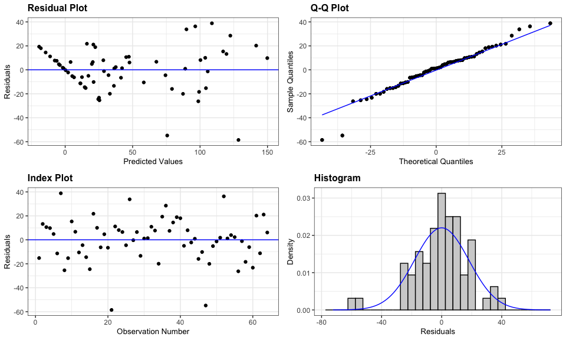
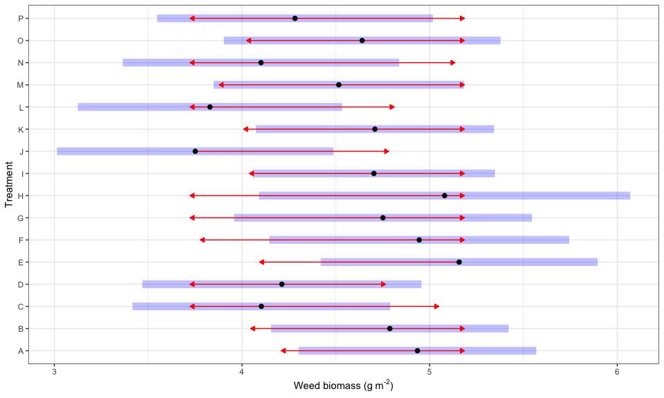
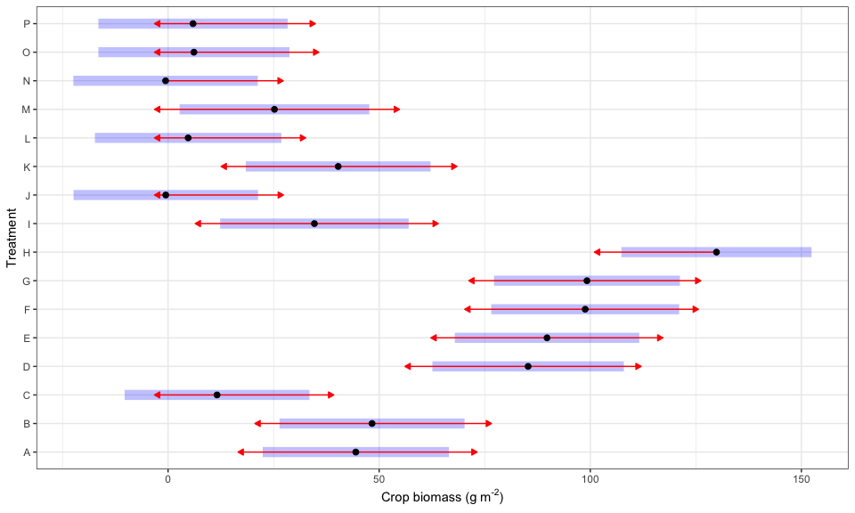

```r
fsb <- read_csv("../2-Data/Clean/fsb_clean.csv")
```

```
## Rows: 64 Columns: 6
## ── Column specification ────────────────────────────────────────────────────────
## Delimiter: ","
## chr (3): treatment, species.x, species.y
## dbl (3): block, crop.biomass.g.per.sq.m, weed.biomass.g.per.sq.m
## 
## ℹ Use `spec()` to retrieve the full column specification for this data.
## ℹ Specify the column types or set `show_col_types = FALSE` to quiet this message.
```

### Crop biomass in response to treatment and weed biomass 


```r
# Worsen the residual plot look
# crops.lm <- lm( log(crop.biomass.g.per.sq.m + min(crop.biomass.g.per.sq.m[crop.biomass.g.per.sq.m > 0]))  ~ as.factor(block) + 
#                   treatment +
#                   log(weed.biomass.g.per.sq.m +  min(weed.biomass.g.per.sq.m[weed.biomass.g.per.sq.m  > 0])),
#                 data = fsb)

# No improvement compared to no data transformation 
# crops.lm <- lm(sqrt(crop.biomass.g.per.sq.m ) ~ as.factor(block) + treatment + weed.biomass.g.per.sq.m, data = fsb)

crops.lm <- lm(crop.biomass.g.per.sq.m  ~ as.factor(block) + treatment + weed.biomass.g.per.sq.m, data = fsb)
resid_panel(crops.lm)
```

<!-- -->

### Weed biomass in response to treatment and crop biomass 

```r
## Transforming crop.biomass.g.per.sq.m may be unnecessary because the Control treatment was mean to be zero for crop biomass 

weeds.lm <- lm(log(weed.biomass.g.per.sq.m +  min(weed.biomass.g.per.sq.m[weed.biomass.g.per.sq.m > 0])) ~ as.factor(block) + treatment + crop.biomass.g.per.sq.m, data = fsb)

resid_panel(weeds.lm)
```

<!-- -->

Weed suppression from different *Brassicacaea* species was comparable (Table \@ref(tab:anova)A), even though crop biomass differed by species (Table \@ref(tab:anova)B).  


```r
#Make a side by side table 
crops.anova <- joint_tests(crops.lm) %>% print(export = TRUE)
weeds.anova <- joint_tests(weeds.lm) %>% print(export = TRUE)
```

```
## Warning in (function (object, at, cov.reduce = mean, cov.keep = get_emm_option("cov.keep"), : There are unevaluated constants in the response formula
## Auto-detection of the response transformation may be incorrect
```

```
## Note: Use 'contrast(regrid(object), ...)' to obtain contrasts of back-transformed estimates
```

```r
cbind( weeds.anova$summary, crops.anova$summary) %>%
  kable(caption = "ANOVA tables of crop and weed responses") %>%
  add_header_above(c(" " = 1,  "Weed" = 5, "Crop" = 5))
```

<table>
<caption>(\#tab:anova)ANOVA tables of crop and weed responses</caption>
 <thead>
<tr>
<th style="empty-cells: hide;border-bottom:hidden;" colspan="1"></th>
<th style="border-bottom:hidden;padding-bottom:0; padding-left:3px;padding-right:3px;text-align: center; " colspan="5"><div style="border-bottom: 1px solid #ddd; padding-bottom: 5px; ">Weed</div></th>
<th style="border-bottom:hidden;padding-bottom:0; padding-left:3px;padding-right:3px;text-align: center; " colspan="5"><div style="border-bottom: 1px solid #ddd; padding-bottom: 5px; ">Crop</div></th>
</tr>
  <tr>
   <th style="text-align:left;">   </th>
   <th style="text-align:left;"> model term              </th>
   <th style="text-align:left;"> df1 </th>
   <th style="text-align:left;"> df2 </th>
   <th style="text-align:left;"> F.ratio </th>
   <th style="text-align:left;"> p.value </th>
   <th style="text-align:left;"> model term              </th>
   <th style="text-align:left;"> df1 </th>
   <th style="text-align:left;"> df2 </th>
   <th style="text-align:left;"> F.ratio </th>
   <th style="text-align:left;"> p.value </th>
  </tr>
 </thead>
<tbody>
  <tr>
   <td style="text-align:left;">  </td>
   <td style="text-align:left;"> block </td>
   <td style="text-align:left;"> 3 </td>
   <td style="text-align:left;"> 44 </td>
   <td style="text-align:left;"> 8.291 </td>
   <td style="text-align:left;"> 0.0002 </td>
   <td style="text-align:left;"> block </td>
   <td style="text-align:left;"> 3 </td>
   <td style="text-align:left;"> 44 </td>
   <td style="text-align:left;"> 5.247 </td>
   <td style="text-align:left;"> 0.0035 </td>
  </tr>
  <tr>
   <td style="text-align:left;">  </td>
   <td style="text-align:left;"> treatment </td>
   <td style="text-align:left;"> 15 </td>
   <td style="text-align:left;"> 44 </td>
   <td style="text-align:left;"> 1.210 </td>
   <td style="text-align:left;"> 0.3008 </td>
   <td style="text-align:left;"> treatment </td>
   <td style="text-align:left;"> 15 </td>
   <td style="text-align:left;"> 44 </td>
   <td style="text-align:left;"> 13.762 </td>
   <td style="text-align:left;"> &lt;.0001 </td>
  </tr>
  <tr>
   <td style="text-align:left;">  </td>
   <td style="text-align:left;"> crop.biomass.g.per.sq.m </td>
   <td style="text-align:left;"> 1 </td>
   <td style="text-align:left;"> 44 </td>
   <td style="text-align:left;"> 10.367 </td>
   <td style="text-align:left;"> 0.0024 </td>
   <td style="text-align:left;"> weed.biomass.g.per.sq.m </td>
   <td style="text-align:left;"> 1 </td>
   <td style="text-align:left;"> 44 </td>
   <td style="text-align:left;"> 4.335 </td>
   <td style="text-align:left;"> 0.0432 </td>
  </tr>
</tbody>
</table>
### Contrasts 


```r
plot(emmeans(weeds.lm, "treatment"), comparisons = TRUE) + 
  xlab(expression(paste("Weed biomass (",g~m^{"-2"},")"))) +
  ylab("Treatment")
```

```
## Warning in (function (object, at, cov.reduce = mean, cov.keep = get_emm_option("cov.keep"), : There are unevaluated constants in the response formula
## Auto-detection of the response transformation may be incorrect
```

<!-- -->


```r
plot(emmeans(crops.lm, "treatment"), comparisons = TRUE) + 
  xlab(expression(paste("Crop biomass (",g~m^{"-2"},")"))) +
  ylab("Treatment")
```

<!-- -->
